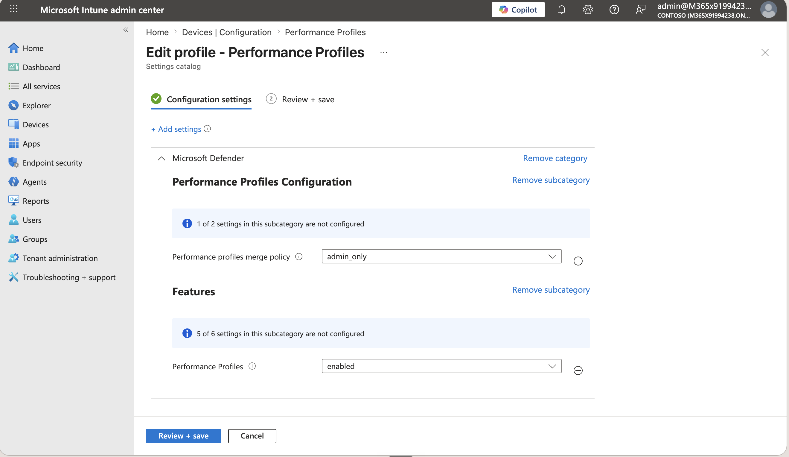
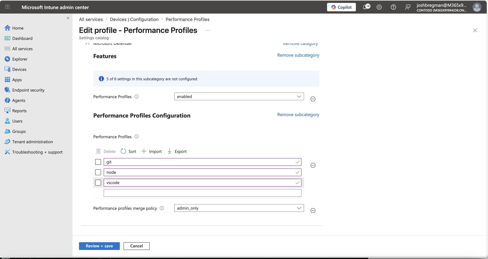

# MDE Performance Profiles — AV Exclusions vs Performance Profiles Demo

Performance profiles are **pre-built configurations** for Microsoft Defender for Endpoint on macOS that reduce the events generated by common developer processes. This makes developer workflows significantly faster while keeping build artifacts and source code protected by real-time protection. Instead of IT admins manually researching exclusions for common developer tools, MDE ships 60+ pre-built profiles that can be activated with a single command.

```bash
# List all available profiles
mdatp performance-profiles list-available

# Apply a profile
mdatp performance-profiles apply xcode

# Apply multiple profiles at once
mdatp performance-profiles apply xcode dotnet-build node

# See what's currently active
mdatp performance-profiles list-active

# Remove a profile
mdatp performance-profiles remove xcode
```

**Why they matter:** Real-time protection scans every file read/write operation. During software builds, compilers read and write thousands of files per second. Without tuning, MDE’s scanning can add 30–200% overhead to build times. Build artifacts are critical assets — they need to stay protected. Performance profiles solve the performance problem without creating a protection gap.

> **Learn more:** [Performance profiles documentation](https://learn.microsoft.com/en-us/defender-endpoint/performance-profiles)

## Demo Overview

This demo tells a complete story in 5 phases: showing not just that performance profiles are faster, but that folder exclusions — a common approach — create a protection gap on the very build artifacts that need to be secured.

| Phase | What Happens | Security Signal |
|---|---|---|
| **1. Baseline Build** | Build with no exclusions, no profiles | Reference point — full protection, full overhead |
| **2. AV Exclusions Build** | Apply folder exclusions, rebuild, place EICAR test file in excluded dir | ⚠️ Build is faster — but **EICAR is NOT detected** |
| **3. Compensating Scan** | Run `mdatp scan custom --ignore-exclusions` (blocking) | ✅ EICAR found — but this scan is required every build |
| **4. Profiles Build** | Remove exclusions, apply performance profiles, rebuild, place EICAR | ✅ Build is fast **and** EICAR **is detected** by real-time protection |
| **5. Compare Results** | 3-way table: Baseline vs Exclusions vs Profiles | Profiles = same perf gain, zero security trade-off, no compensating scan |

**Key message:** Performance profiles work by reducing the events generated by developer processes — build directories and artifacts remain protected by real-time protection. Folder exclusions can also improve build performance, but they create a protection gap: files in excluded directories are not scanned, including the build artifacts themselves. Performance profiles deliver the same performance improvement without that tradeoff.

## Available Scenarios

| Scenario | Target Repo | Build System | Excluded Dirs (AV phase) | Profiles Used |
|---|---|---|---|---|
| `vscode` | [microsoft/vscode](https://github.com/microsoft/vscode) | Node.js / TypeScript | `node_modules/`, `out/`, `.build/` | `node`, `git`, `vscode`, `vscode-tree` |
| `xcode` | [microsoft/fluentui-apple](https://github.com/microsoft/fluentui-apple) | Xcode / Swift | `DerivedData/`, `.build/` | `xcode`, `xcode-ide-tree`, `git` |
| `xcode-simulator` | In-repo `apps/hello-defender-ios` | xcodebuild + simctl | `.mde-derived/` | `xcode`, `ios-simulator-tree`, `iphone-simulator-tree`, `git` |
| `android-studio` | In-repo `apps/hello-defender-android` | Gradle + adb | `.gradle/`, `app/build/` | `android-studio`, `android-studio-tree`, `java`, `git` |

## Prerequisites

- **macOS** with [Microsoft Defender for Endpoint](https://learn.microsoft.com/en-us/defender-endpoint/microsoft-defender-endpoint-mac) installed
- MDE version that supports performance profiles (check `mdatp performance-profiles list-available`)
- **Real-time protection enabled** (`mdatp health --field real_time_protection_enabled` should return `true`)
- `sudo` access — most `mdatp` commands require elevated privileges (profile management, scanning, configuration). The script will prompt for your password on first use.
- Build tools for your chosen demo:
  - **VS Code demo:** `node` (v24+), `git`, `python3`, Xcode Command Line Tools — see the [official VS Code build prerequisites](https://github.com/microsoft/vscode/wiki/How-to-Contribute#prerequisites)
  - **Xcode demo:** Xcode (with command line tools), `git`
  - **Xcode Simulator demo:** Xcode (with command line tools), `xcrun`
  - **Android Studio demo:** Android Studio, Android SDK (with `adb` and `emulator`), an Android Virtual Device

### One-Time Setup

```bash
# ── For the VS Code demo ──

# Install build tools (Python + Xcode CLT also required for node-gyp)
brew install node@24 git
xcode-select --install   # if not already installed

# Clone VS Code (pinned to a stable tag) — or let the demo do it automatically
git clone --depth 1 --branch 1.122.1 https://github.com/microsoft/vscode.git ~/demo/vscode
cd ~/demo/vscode
npm install   # follows official VS Code build steps

# ── For the Xcode demo ──

# Clone Fluent UI Apple — or let the demo clone it automatically
git clone https://github.com/microsoft/fluentui-apple.git ~/demo/fluentui-apple
```

## Running the Demo

```bash
chmod +x perf-profile-demo.sh
./perf-profile-demo.sh
```

When run interactively without arguments, the script caches sudo credentials and then presents a configuration menu before starting:

```
⚙️  Demo defaults (select one to change, Enter to run):
  1) Scenario: vscode
  2) Repo path override: '(default)'
  3) Resume from phase: '(none)'
  4) Include install in timed build: off
  5) Profile change policy: prompt
Choose [1-5], R=run, Q=quit (default: R):
```

Select a number to change that option, press **Enter** (or **R**) to run with the shown defaults, or **Q** to quit. Any option set via a CLI flag is shown as `[locked via CLI]` and cannot be changed in the menu.

You can also pass options directly on the command line — any option supplied this way is shown as `[locked via CLI]` in the menu and cannot be changed interactively:

```bash
# Run a specific scenario
./perf-profile-demo.sh vscode
./perf-profile-demo.sh xcode
./perf-profile-demo.sh xcode-simulator
./perf-profile-demo.sh android-studio

# Use a custom repo path
./perf-profile-demo.sh vscode --repo ~/my/vscode/checkout

# Choose consent policy for applying/removing profiles
./perf-profile-demo.sh vscode --profile-change-policy always   # no prompts
./perf-profile-demo.sh vscode --profile-change-policy never    # never apply/remove

# Resume from a specific phase (0-based index)
./perf-profile-demo.sh vscode --resume-from 4
```

## The 5-Phase Story

### Phase 1 — Baseline Build

Build the project with no exclusions and no performance profiles. This is the reference point: full real-time protection, full overhead. Capture build time and MDE CPU usage.

### Phase 2 — AV Exclusions Build

Apply default folder exclusions for the scenario (e.g., `node_modules/`, `out/`, `.build/`). Rebuild. The build is faster — but before the audience celebrates, place an EICAR test file inside one of the excluded directories. Check whether MDE detected it.

**Result:** MDE did NOT detect the EICAR. The exclusion hid it from real-time protection.

> **Talking point:** "This is the security trade-off of folder exclusions. We told MDE 'never look in `out/`' — and now it can't see malware that lands there during or after a build."

### Phase 3 — Compensating Scan

Run a custom scan with `--ignore-exclusions` over the excluded directories. This is a **blocking** step — the audience watches it run.

**Result:** The compensating scan finds the EICAR. 

> **Talking point:** "Security best practice says: if you use AV exclusions, you need a compensating control. That means running this scan after every build — adding overhead back in, but now you have to manage it, schedule it, and remember to do it."

### Phase 4 — Profiles Build

Remove all folder exclusions. Apply performance profiles. Rebuild. Place EICAR in the same directory again. Check whether MDE detected it.

**Result:** MDE detected the EICAR via real-time protection — no compensating scan needed.

> **Talking point:** "Profiles use smart patterns. They skip `.tsbuildinfo` cache files, compiled JavaScript intermediates — known-safe build artifacts — but they still watch for threats in those directories. Same build speedup. Full protection. No compensating scan required."

### Phase 5 — Compare Results

A 3-way table: Baseline vs AV Exclusions vs Profiles. Same build speedup, but profiles deliver it without the security trade-off or operational overhead.

## Admin-Only Mode (MDM-Managed Profiles)

When performance profiles are deployed via MDM (Intune, JAMF, etc.), the endpoint is in **admin-only mode** — local users cannot apply or remove profiles. The demo detects this automatically.

#### Step 1: Enable Performance Profiles in Intune

In your management portal, create or edit a **Settings Catalog** policy. Add the **Microsoft Defender > Performance Profiles Configuration** and **Features** settings:

- **Performance profiles merge policy** → `admin_only`
- **Performance Profiles** → `enabled`

**Intune:**


**Security Settings Management (Microsoft Defender portal):**



#### Step 2: Run the Baseline (Session 1)

Run the demo script. It detects admin-only mode with no profiles applied and runs through the baseline, AV exclusions, and compensating scan phases. After saving a checkpoint, it exits with instructions:

```
⚠️  Admin-only mode — profiles cannot be applied locally.
Ask your IT admin to deploy these profiles via MDM (Intune, JAMF, etc.):
  - node
  - git
  - vscode
  - vscode-tree

Once deployed, re-run this script to continue.
(Your baseline results have been saved — you'll be prompted to continue.)
```

#### Step 3: Deploy Profiles via MDM

In **Microsoft Defender > Performance Profiles Configuration > Performance Profiles**, add the profiles requested by the demo (for VS Code: `git`, `node`, `vscode`, `vscode-tree`).

**Intune profile selection example:**



Deploy the requested profiles through your MDM solution.

#### Step 4: Resume the Demo (Session 2)

Re-run the script. It detects the saved checkpoint and prompts:

```
📋 Previous run detected — baseline already complete.
   Baseline build time: 182 seconds

Continue to profiles build, or restart from scratch? [C/r]
```

Press **Enter** (or **C**) to resume from the Profiles Build phase.

---

## Available Profiles

The scripts use profiles relevant to the build being demonstrated. Here are some of the 60+ profiles available:

| Profile | What It Excludes |
|---|---|
| `xcode` | Xcode.app, DerivedData, build intermediates, simulator runtimes |
| `xcode-ide-tree` | Xcode IDE workspace caches and index files |
| `dotnet-build` | `bin/`, `obj/`, NuGet caches, MSBuild temp files |
| `node` | `node_modules/`, npm caches, V8 compilation cache |
| `git` | `.git/` objects, pack files, index operations |
| `make-tree` | Make build output trees |
| `rust` | `target/`, cargo registry, incremental compilation cache |
| `google-golang` | Go module cache, build cache, `GOPATH` artifacts |
| `vscode` / `vscode-tree` | VS Code extension host, workspace storage |
| `docker` | Docker images, volumes, build cache |
| `jetbrains` | IntelliJ/PyCharm/Rider caches and indexes |

Run `mdatp performance-profiles list-available` to see the full list.

## Expected Results

Results vary by hardware (Apple Silicon vs Intel), disk speed, and MDE version. Typical results:

| Metric | Baseline | AV Exclusions | Profiles | Best Choice |
|---|---|---|---|---|
| VS Code build time | ~180s | ~120s | ~120s | Tie |
| MDE CPU (avg) | 80–120% | 5–15% | 5–15% | Tie |
| EICAR detection (RTP) | ✅ Yes | ⚠️ **No** | ✅ Yes | **Profiles** |
| Compensating scan needed | No | ⚠️ **Yes** | No | **Profiles** |

> **Tip:** Run the demo on your target hardware at least once before presenting to get real numbers for your environment.

## Presenter Talking Points

1. "A customer calls: 'MDE is slowing down our developer builds on macOS.'"
2. "The first instinct is to add folder exclusions. Let's show what happens when you do that."
3. "Build is faster — great. But look: EICAR landed in that excluded directory and MDE never saw it."
4. "The fix? A compensating scan after every build. Now you've added the overhead back in, plus operational complexity."
5. "Performance profiles solve this properly. They use smart patterns — skipping known-safe build artifacts, not entire directories."
6. "Same build speedup. Full real-time protection. No compensating scan. No security gap."
7. "We ship **60+ profiles** — Xcode, .NET, Docker, Rust, Go, JetBrains, and more. One command to apply."
8. "That's the difference: folder exclusions create a protection gap on build artifacts. Performance profiles maintain protection while delivering the same performance improvement."

## Other Repos to Try

These Microsoft first-party repos also work well with performance profiles:

| Repo | Profiles | Build Command | Notes |
|---|---|---|---|
| [PowerShell/PowerShell](https://github.com/PowerShell/PowerShell) | `dotnet-build`, `git` | `dotnet build` | .NET build, 2–5 min |
| [dotnet/maui](https://github.com/dotnet/maui) | `dotnet-build`, `xcode`, `git` | `dotnet build -f net8.0-maccatalyst` | Xcode + .NET combo |
| [dotnet/runtime](https://github.com/dotnet/runtime) | `dotnet-build`, `git`, `make-tree` | `./build.sh` | Long build (15–30 min) |

## Contributing

Found a bug or want to improve these scripts? PRs welcome! See the [contribution guidelines](../../CONTRIBUTING.md).
