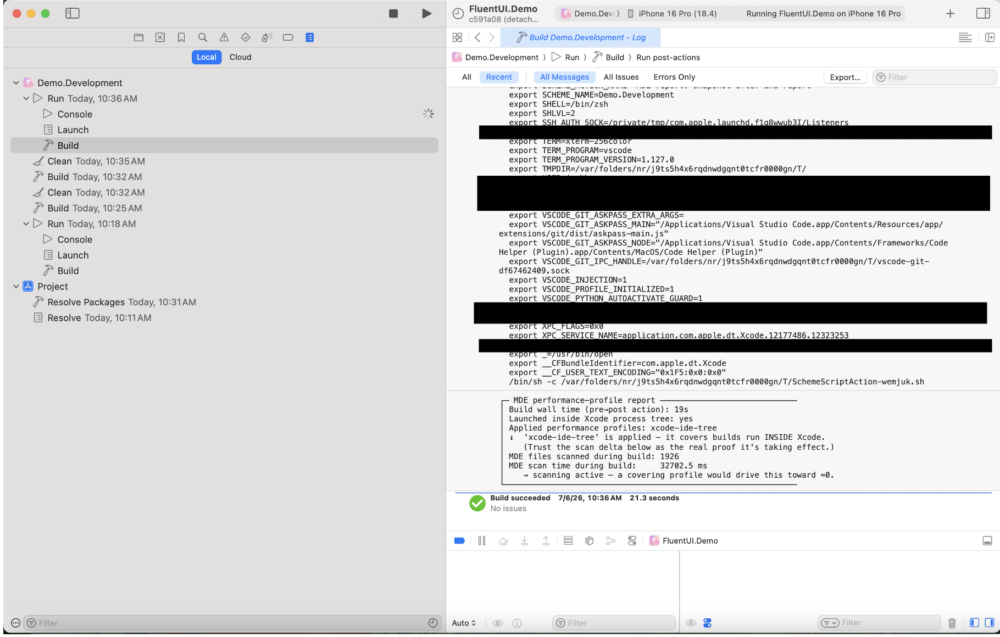

# Xcode Performance Profile Demo

Measures how Microsoft Defender for Endpoint (MDE) affects a real Swift/Xcode build,
and shows how the **`xcode` performance profile** removes the scan overhead *without*
opening the protection gap that AV folder exclusions do.

The demo builds Microsoft's own open-source **[fluentui-apple](https://github.com/microsoft/fluentui-apple)**
package (MIT-licensed, SwiftPM-native) as a realistic Swift workload. That project is
**not vendored** into this repo — `setup-project.sh` shallow-clones a pinned commit
into a gitignored `workload.noindex/` directory the first time you run the demo.

## Quick Start

```bash
cd sample-projects/xcode
./run-demo.sh
```

`run-demo.sh` auto-runs `setup-project.sh` if the workload is missing, then runs three
phases and writes a `REPORT.md` under `run-logs/<timestamp>/`.

1. **Baseline** — full scanning, full protection.
2. **AV Exclusions** — exclude the build directories (faster, but EICAR goes undetected).
3. **Performance Profiles** — apply the `xcode` profile (fast AND EICAR still detected).

## What Gets Measured

Each phase runs a warm-up build plus several timed builds and records, as deltas across
the phase, into the report:

- **Median / average build time**
- **MDE files scanned** and **scan time** (from `real-time-protection-statistics`)
- **AV / EDR / all-daemon average CPU %** and **peak RSS**
- **EICAR detection** — ✅ Detected vs ❌ Missed
- **Scan Activity by Phase** — hot-event **Sources** (processes driving scans) and
  **Targets** (the actual files/paths scanned). Targets are the direct signal for
  whether an exclusion is actually being honored.

## The Story

- **Phase 1 (Baseline):** MDE scans the toolchain and every build artifact. Highest CPU.
- **Phase 2 (Exclusions):** Excluding `.build`/`DerivedData` speeds the build, but an
  EICAR file dropped into an excluded folder is **not detected** — a protection gap.
- **Phase 3 (Profiles):** The `xcode` profile mutes the toolchain's scan load, so the
  build stays fast **and** EICAR is still detected. No protection gap.

## Terminal build vs. in-IDE build (important)

There are two related profiles, and they cover different things:

- **`xcode`** — matches the Swift/Clang toolchain by its install location. It applies to
  a command-line `swift build`, so it is the profile this terminal demo uses
  (`DEMO_PROFILES="xcode git"` by default).
- **`xcode-ide-tree`** — only mutes builds launched from **inside the Xcode IDE process
  tree**. A terminal `swift build` is *not* covered by it. To exercise this profile,
  open the workload in Xcode and build with Cmd+B:

  ```bash
  ./open-demo.sh   # fetches the workload and opens Package.swift in Xcode (recommended)
  ```

  `open-demo.sh` opens the Swift package by default so you can build scheme
  `FluentUI` on destination `My Mac` without iOS signing requirements, then prints
  the exact `mdatp performance-profiles apply --name xcode-ide-tree` steps.

  If you specifically want the iOS demo project path, use:

  ```bash
  ./open-demo.sh --ios-demo
  ```

  Then build `Demo.Development` on an iOS Simulator destination.
  (`Demo.Dogfood` is optional and requires extra AppCenter/provisioning setup.)

  If `Demo.Dogfood` fails with SDK symbol errors such as `UIGlassEffect`,
  `UICornerRadius`, or `UINavigationItem.subtitle`, use this fallback IDE path:

  - Scheme: `FluentUI`
  - Destination: `My Mac`
  - Build: Cmd+B

  This still runs inside Xcode's process tree, so it is valid for demonstrating
  `xcode-ide-tree` profile behavior on machines without the newest iOS SDK.

> Note: the earlier version of this demo referenced a profile named `xcode-tree`. That
> profile does not exist — the real names are `xcode` and `xcode-ide-tree`.

## Detailed IDE Flow

Use this when you want the interactive Xcode demonstration rather than the automated
terminal `run-demo.sh` flow.

### Option A: Recommended My Mac flow

This is the most reliable IDE path on machines where the iOS demo project may require
extra SDK, signing, or AppCenter setup.

1. Open the workload:

  ```bash
  cd sample-projects/xcode
  ./open-demo.sh
  ```

2. Wait for Xcode to finish loading the package and auto-creating the `FluentUI` scheme.

3. In Xcode, select:
  - **Scheme:** `FluentUI`
  - **Destination:** `My Mac`

4. Run a baseline IDE build with **Cmd+B**.

5. Capture a manual MDE report around the next build:

  ```bash
  ./mde-profile-report.sh before
  # switch back to Xcode and press Cmd+B once
  ./mde-profile-report.sh after
  ```

6. Apply the IDE-tree profile:

  ```bash
  sudo mdatp performance-profiles apply --name xcode-ide-tree
  ```

7. Run the same manual bracket again around another **Cmd+B** build:

  ```bash
  ./mde-profile-report.sh before
  # switch back to Xcode and press Cmd+B once
  ./mde-profile-report.sh after
  ```

8. Compare the before/after output. The key signal is that **MDE files scanned during build**
  drops toward ≈0 when the profile is taking effect.

9. Remove the profile when done:

  ```bash
  sudo mdatp performance-profiles remove --name xcode-ide-tree
  ```

### Option B: iOS Simulator flow

Use this if you want the in-Xcode automatic pre/post-action report card.

1. Open the iOS demo project:

  ```bash
  cd sample-projects/xcode
  ./open-demo.sh --ios-demo
  ```

2. In Xcode, select:
  - **Scheme:** `Demo.Development`
  - **Destination:** any **iOS Simulator**

3. Install the automatic report hook:

  ```bash
  ./xcode-report.sh on
  ```

4. Fully quit and reopen Xcode if the scheme was already open before you installed the hook.

5. Build once with **Cmd+B**.

6. Check the report output in either place:
  - Xcode **Report navigator**: **Cmd+9** → latest Build → search for `MDE performance-profile report`
  - temp file: `$TMPDIR/mde-xcode-report.txt`

7. Apply the IDE-tree profile and build again:

  ```bash
  sudo mdatp performance-profiles apply --name xcode-ide-tree
  ```

8. Recheck the Report navigator / temp file and compare the scan delta.

9. Clean up when done:

  ```bash
  sudo mdatp performance-profiles remove --name xcode-ide-tree
  ./xcode-report.sh off
  ```

### What to look for

- **Activity Monitor:** sort by `wdavdaemon_unprivileged` CPU to watch live impact.
- **Report card:** compare `Applied performance profiles`, `Launched inside Xcode process tree`,
  and `MDE files scanned during build`.
- **Ground truth:** trust the scan delta more than wall-clock time.

### Where the Xcode report appears

When the automatic hook is installed, the report is shown in the Xcode build log under:

- **Report navigator** (`Cmd+9`)
- latest **Build** entry for the `Demo.Development` run
- **Run post-actions**

In practice, the path looks like:

- `Demo.Development` → `Run` → `Build` → `Run post-actions`

Example from Xcode:



Direct image link: [docs/xcode-report-navigator.png](docs/xcode-report-navigator.png)

If you do not see the report block there, search the build log for:

- `MDE performance-profile report`
- `MDE files scanned during build`

The same output is also written to:

- `$TMPDIR/mde-xcode-report.txt`

Example report output:

```text
┌─ MDE performance-profile report ─────────────────────────────
│ Build wall time (pre→post action): 19s
│ Launched inside Xcode process tree: yes
│ Applied performance profiles: xcode-ide-tree
│ ℹ  'xcode-ide-tree' is applied — it covers builds run INSIDE Xcode.
│    (Trust the scan delta below as the real proof it's taking effect.)
│ MDE files scanned during build: 1926
│ MDE scan time during build:     32702.5 ms
│    → scanning active — a covering profile would drive this toward ≈0.
└──────────────────────────────────────────────────────────────
```

That example is a **successful report surfacing** case: the hook is working, Xcode is
recognized as the launch context, and the remaining task is to compare before/after
profile runs to see whether the scan counts collapse toward ≈0.

### Troubleshooting

- If you do not see `Demo.Development`, open the iOS project with `./open-demo.sh --ios-demo`.
- If you do not see any `MDE` lines in the Report navigator, rerun `./xcode-report.sh on`,
  quit Xcode, reopen, and build the `Demo.Development` scheme again.
- If the iOS demo build fails, fall back to **Option A** (`FluentUI` on `My Mac`), which still
  demonstrates `xcode-ide-tree` coverage.
- If the report file looks stale, run a fresh `before` / build / `after` cycle manually.

## In-build report card (verify the profile live)

The Xcode analog of the Android sample's Gradle report card. `mde-profile-report.sh`
reads (never changes) MDE state — `mdatp performance-profiles list-applied` and
`mdatp diagnostic real-time-protection-statistics` — and reports, for a single build:
which profiles are applied, whether one covers the build, and **MDE files scanned /
scan time during the build** (the empirical proof — drops toward ≈0 when covered).

Xcode has no global init directory like Gradle's `~/.gradle/init.d`, so the report is
wired in as Scheme **Build pre/post-actions** (Edit Scheme → Build → Pre-actions /
Post-actions). `xcode-report.sh` injects/removes them on the iOS demo
`Demo.Development` scheme:

```bash
./xcode-report.sh on       # inject pre/post-actions into Demo.Development
# open FluentUI.Demo.xcodeproj, select Demo.Development, Build (Cmd+B)
./xcode-report.sh off      # remove them when done
```

When you use the package-first fallback path (`FluentUI` scheme on `My Mac`), those
pre/post-actions do not fire. Use a manual bracket instead:

```bash
./mde-profile-report.sh before
# build once in Xcode (Cmd+B)
./mde-profile-report.sh after
```

The rendered output is also written to `$TMPDIR/mde-xcode-report.txt`.

The pre-action snapshots MDE scan counters; the post-action snapshots again and prints
the report card. Because Xcode buries pre/post-action output in the build log (Report
navigator), the post-action also fires a desktop notification and writes the report to
`$TMPDIR/mde-xcode-report.txt`.

**Demo flow that proves the profile is correct:** build once (report shows scanning
active) → `sudo mdatp performance-profiles apply --name xcode-ide-tree` → build again
(files scanned during the build collapse toward ≈0). The before/after report card *is*
the proof.

> The toolchain profile (`xcode`) is a definitive coverage signal — it matches by
> install location. `xcode-ide-tree` only covers processes inside the IDE tree, and the
> "inside Xcode tree" line is a heuristic (it can read "can't tell"), so trust the scan
> delta as the ground truth.

## Prerequisites

- macOS with Microsoft Defender for Endpoint installed
- Real-time protection enabled (`mdatp health --field real_time_protection_enabled` → `true`)
- Xcode + command-line tools (`swift` and `xcodebuild` on `PATH`)
- `sudo` access (for `mdatp` exclusion/profile commands)
- Network access on first run (to clone the workload)

If Tamper Protection is in `block` mode, `real-time-protection-statistics` can return
null; enable troubleshooting mode so scan counts are captured (see the macOS perf TSG).

## Build Details

- **Workload:** `microsoft/fluentui-apple` (MIT), pinned commit, cloned into `workload.noindex/`
- **Build command:** `swift build --product FluentUI` (debug) against the macOS SDK
- **Build output directory:** `.build/` (removed between builds for a clean recompile)
- **AV exclusion paths (Phase 2):** `.build/`, `DerivedData/`
- **Profiles applied (Phase 3):** `xcode`, `git` (override with `DEMO_PROFILES=...`)

## Configuration

Environment variables honored by the scripts:

| Variable | Default | Purpose |
|---|---|---|
| `DEMO_PROFILES` | `xcode git` | Profiles applied in Phase 3 |
| `MDE_SWIFT_PRODUCT` | `FluentUI` | SwiftPM product to build |
| `MDE_WORKLOAD_REPO` | `microsoft/fluentui-apple` | Workload git repo |
| `MDE_WORKLOAD_REF` | pinned SHA | Workload commit/ref to check out |

## Files

- `setup-project.sh` — clones the pinned workload into `workload.noindex/`
- `run-demo.sh` — the measured three-phase terminal demo (generates `REPORT.md`)
- `open-demo.sh` — opens FluentUI.Demo.xcodeproj in Xcode for the `xcode-ide-tree` path
- `mde-profile-report.sh` — MDE report card printed by the scheme Build pre/post-actions
- `xcode-report.sh` — installs/removes the report-card pre/post-actions on the `Demo.Development` scheme
- The report is rendered by the shared `../lib/generate-report.js`

## Cleanup

```bash
rm -rf workload.noindex run-logs
```

## Attribution

The build workload is [microsoft/fluentui-apple](https://github.com/microsoft/fluentui-apple),
© Microsoft, licensed under the MIT License. It is fetched at setup time and is not
redistributed as part of this repository.
