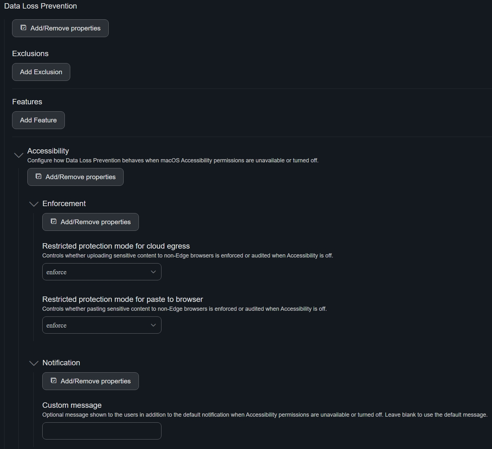

# Accessibility Example
Adds support for extracting and forwarding DLP accessibility settings from managed configuration to Endpoint DLP for macOS 27 (Golden Gate).

- Restricted protection mode for cloud egress --> unallowedBrowserMode
- Restricted protection mode for paste to browser --> pasteToBrowserMode
- Accessibility permission notification --> notification

### Intune
This sample configuration profile sets the restricted protection mode for cloud egress and paste to browser, along with the notification message that prompts users to turn on Accessibility permissions. : [com.microsoft.wdav.mobileconfig](./com.microsoft.wdav.mobileconfig).

### JAMF Pro

**Using schema.json**

Modify the existing MDE Prefereneces Configuration Profile to use the latest version of [schema.json](/macos/schema/schema.json). Then add the `Data Loss Prevention` key, and `Accessibility` subkey.  Add the individual Accessibility Flag here.

**Using plist**

Example plist file to set enforcement for accessibility: [com.microsoft.wdav.plist](./com.microsoft.wdav.plist).

