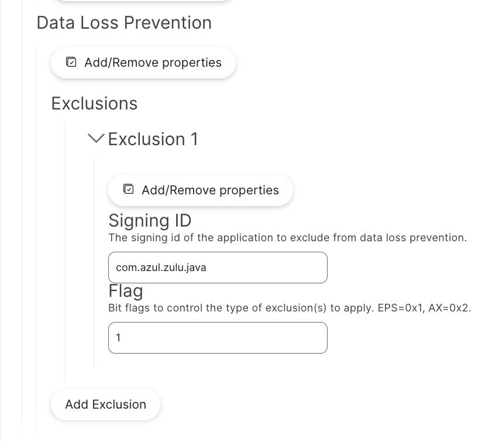

# Process Exclusion Example
File activity triggers events in the dlpdaemon via the Endpoint Security Framework (EPS), potentially impacting performance. Customers may use MDM solutions to mute specific processes.

### Intune
For Intune users, create a configuration profile to exclude specific signing IDs from DLP enforcement.
Example mobileconfig file for excluding the com.azul.zulu.java signing ID: [com.microsoft.wdav.mobileconfig](./com.microsoft.wdav.mobileconfig).

### JAMF Pro
For Jamf Pro users, create a configuration profile under Application & Custom Settings with the following:
- Preferences Domain: com.microsoft.wdav.ext

- Scope: Required groups/users

**Using schema.json**

Modify the MDE Preferences Configuration Profile to use the latest version of [schema.json](/macos/schema/schema.json). Add the `Data Loss Prevention` key with the `Exclusions` sub-key,  then include individual signing IDs.

**Using plist**

Example plist file to exclude the com.azul.zulu.java signing ID: [com.microsoft.wdav.plist](./com.microsoft.wdav.plist).